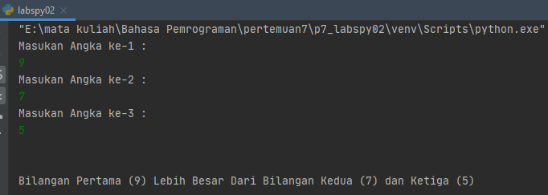
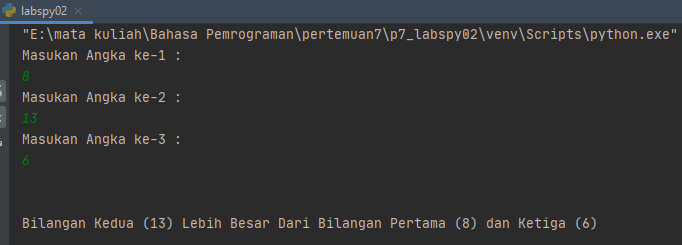
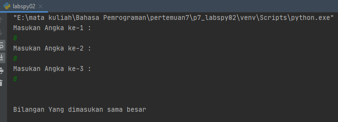
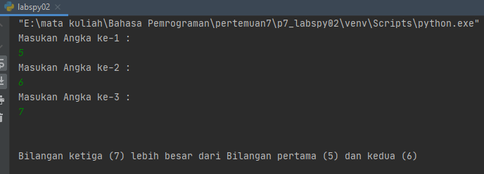

# p7_labspy02
repository ini di buat untuk memenuhi tugas pada pertemuan 7 bahasa pemrograman (modul praktikum 2)<br><br>
Nama    : PIKRI RAMDANI<br>
NIM     : 312010162<br>
Kelas   : TI.20 A.1<br><br>
<hr>


### Menentukan Bilangan Terbesar dari 3 nilai yang diinputkan

<br>
Pada Pertemuan ke-7 ini saya mendapat tugas dari Dosen Bahasa Pemrograman Teknik Informatika - Universitas Pelitas Bangsa yaitu Bapak. Agung Nugroho,S.Kom.,M.Kom. untuk membuat Aplikasi yang menentukan Bilangan terbesar dari tiga nilai client/user inputkan menggunakan Bahasa Pemrograman Python.<br><br>


Pada repository ini saya akan menjelaskan alur dalam *Flowchart* yang telah saya buat. File *Flowchart* bisa dilihat pada Link berikut ini : [Flowchart P7 Menentukan Bilangan Terbesar Dari 3 Nilai Yang diinputkan](flowchart-per7-pikri-ramdani-312010162.pdf)
<br><br>
Berikut source code yang saya tulis untuk menjadikan aplikasi tersebut. 

``` python
print("Masukan Angka ke-1 : ")
angka1=int(input())
print("Masukan Angka ke-2 : ")
angka2=int(input())
print("Masukan Angka ke-3 : ")
angka3=int(input())

print("\n")

if (angka1 > angka2) and (angka1 > angka3) :
    print(f"Bilangan Pertama ({angka1}) Lebih Besar Dari Bilangan Kedua ({angka2}) dan Ketiga ({angka3})")

elif (angka2 > angka1) and (angka2 > angka3) :
    print(f"Bilangan Kedua ({angka2}) Lebih Besar Dari Bilangan Pertama ({angka1}) dan Ketiga ({angka3}) ")

elif (angka3 == angka1) and (angka3 == angka2) and (angka2 == angka3) :
    print("Bilangan Yang dimasukan sama besar ")

else:
    print(f"Bilangan ketiga ({angka3}) lebih besar dari Bilangan pertama ({angka1}) dan kedua ({angka2}) ")
```
Untuk Penjelasan fungsi input dan print saya tidak akan menjelaskan pada repository kali ini , karena sudah saya jelaskan di repository sebelumnya.<br> 

* langkah pertama yaitu saya akan membuat sebuah inputan tersebut untuk menentukanangka terbesar. Yaitu dengan mengetikan perintah / syntax berikut :<br>
``` python
print("Masukan Angka ke-1 : ")
angka1=int(input())
print("Masukan Angka ke-2 : ")
angka2=int(input())
print("Masukan Angka ke-3 : ")
angka3=int(input())
```  
<br>

* Langkah selanjutnya yaitu saatnya menentukan logika untuk menentukan bilangan terbesar dari angka yang yang saya inputkan diatas.<br>
 Dengan menjelaskan fungsi-fungsi pada source code yang digunakan diatas :<br> 

* Sesuai *flowchart* yang saya buat, client/user diminta untuk memasukan nilai inputan berupa angka dan akan disimpan kedalam variable angka1, angka2, dan angka3. <br>
Setelah proses input nilai selesai maka saya akan membuat pemilihan angka terbesar berdasarkan kondisi.<>br
<br> Pada kondisi pertama saya akan melakukan pengecekan terhadap Angka pertama (angka1) terlebih dahulu, yaitu dengan syntax/source code seperti dibawah ini :<br>
``` python
if (angka1 > angka2) and (angka1 > angka3) :
``` 
Pada syntax diatas dijelaskan bahwa terdapat dua pengecekan pada angka pertama, yaitu :<br>
    1. *(angka1 > angka2)* -> Apakah Angka Pertama Lebih Besar dari Angka Kedua **dan**
    2. *(angka1 > angka2)* -> Apakah Angka Pertama Lebih Besar dari Angka Ketiga.
<br>
Apabila Jika Pertama bersifat benar (Angka pertama lebih besar dari angka kedua dan ketiga), maka system akan menampilkan output berupa :<br>

``` python
 print(f"Bilangan Pertama ({angka1}) Lebih Besar Dari Bilangan Kedua ({angka2}) dan Ketiga ({angka3}) ")
```    

dan akan memunculkan hasil seperti berikut : **Bilangan Pertama ({angka1}) lebih besar dari Bilangan kedua dan ketiga**<br>
<br>

* Jika dalam pengecekan ada yang salah atau Nilai pertama tidak lebih besar dari Nilai kedua dan ketiga, maka system melakukan pengecekan lanjutan ke fungsi **elif .......** yaitu dengan syntax atau source code berikut :<br>

``` python
 print(f"Bilangan Kedua ({angka2}) Lebih Besar Dari Bilangan Pertama ({angka1}) dan Ketiga ({angka3}) ")
```
dan akan menampilkan hasil seperti : **Bilangan kedua ({angka2}) lebih besar dari bilangan pertama dan ketiga**<br>
<br>

* Seperti langkah diatas, jika dalam pengecekan bersifat salah atau angka lebih kecil dari angka pertama dan ketiga maka system akan melanjutkan ke pengecekan selanjutnya.<br>
Nah untuk pengecekan selanjutnya saya akan melakukan pengecekan berupa *Apakah Nilai yang inputan nilainya sama besar?*.<br> 
``` python
elif (angka3 == angka1) and (angka3 == angka2) and (angka2 == angka3) :
```
Pada syintax diatas, dijelaskan terdapat tiga pengecekan pada semua variable, yaitu :<br>
    1. *(angka1 == angka2)* -> Apakah angka pertama sama besar dengan angka kedua **dan**<br>
    2. *(angka1 == angka3)* -> Apakah angka pertama sama besar dengan angka ketiga **dan**<br>
    3. *(angka2 == angka3)* -> Apakah angka kedua sama besar dengan angka ketiga.
<br>
Apabila setelah dilakukan pengecekan dan ternyata semua angka sama besar, maka system akan menampilkan output dengan perintah berikut :<br>

``` python
 print("Bilangan Yang dimasukan sama besar ")
```     
Dari syntax diatas tersebut akan memunculkan hasil yang berupa : **Bilangan yang dimasukan sama besar**<br>

* Langkah terakhir adalah ketika system sudah melakukan pengecekan pada If, Elif, maka system harus menentukan pilihan terakhir dengan menggunakan fungsi else.
Fungsi else menurut saya adalah dimana kondisi system telah melakukan pengecekan pada fungsi if dan elif tetapi tidak ada hasil yang di inginkan, maka menentukan pilihan akhir, yaitu dengan menampilkan output yang diinginkan.
pada kasus pemrograman ini, saya melakukan pengecekan kondisi seperti berikut :

> Pengecekan pertama pada **angka1** apakah lebih besar, jika tidak, maka melakukan pengecekan pada **angka2** apakah lebih besar, jika masih belum menemukan hasil atau tidak lebih besar, maka dilakukan pengecekan berupa semua bilangan sama besar. untuk langkah terakhirnya maka menampilkan hasil bahwa bilangan ketiga pasti bilangan terbesar.
<br>

Untuk menampilkan hasil akhir, maka hanya dengan mengetikan syntax sebagai berikut :<br>

``` python
else:
    print(f"Bilangan ketiga ({angka3}) lebih besar dari Bilangan pertama ({angka1}} dan kedua ({angka2})")
```

Pada syntax diatas akan menampilkan hasil berupa : **Bilangan ketiga ({angka3}) lebih besar dari bilangan pertama dan kedua**<br>
<br>
Berikut syntax *screenshot* dari Program yang saya buat :<br>
1. Contoh Gambar inputan dengan angka terbesar yang ada di inputan pertama<br>
   
2. Contoh Gambar inputan dengan angka terbesar yang ada di inputan kedua<br>
      
3. Contoh Gambar inputan dengan angka sama besar<br>
   
4. Contoh Gambar inputan dengan angka terbesar yang ada di inputan ketiga<br>   
   
   
<hr>
Demikianlah langkah-langkah untuk melakukan pengecekan pada 3 inputan dengan bahasa pemrograman python<br>

Untuk lebih jelasnya silahkan buka *flowchart* yang telah saya buat (link diatas)
<hr>
Demikian Tugas praktikum 7 - praktikum labspy02 telah saya buat, selesai. saya ucapkan Terima Kasih.<br> 

NAMA    : PIKRI RAMDANI<br>
NIM     : 312010162  
KELAS   : TI.20 A.1